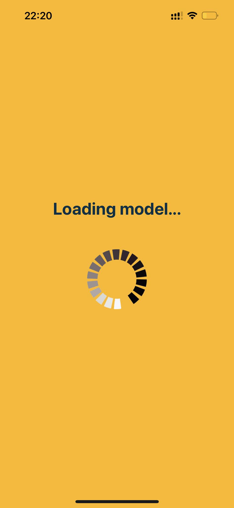

# Skin lesion classification mobile and web app

The aim of this project was to create a universal app that would help users examine their skin lesions.

## About

The project is written to be multi-platform, so basically, it is one code that is then translated to be deployable to the web, Android, and iOS. It allows users to take or select photos that are further classified as either benign or malignant skin changes. As it is rather proof of concept, the model used for classification is simple and during phase test yields results about 60-70% when it comes to accuracy. Models that have an accuracy of about 98% were also created, but managing them in memory (especially for mobile devices) was extremely slow. Therefore, the worst but lighter model was picked to present the concept of this project. After classifying the image as one of these classes, it appears in the history section.

## Tech Stack

To create and develop model **Python** with **Tensorflow**, which is a library related to Machine Learning, was used. Such a model was then saved to a special format, that allowed further usage in the main application. The main code was written with the help of **React Native** - framework in **JavaScrpit** - that was then translated to native platforms during the compilation process. In order to load and manage the model, that was created earlier, **Tensorflowjs** was used at the main application side.  

## How to run

To run an application in non-deployed mode **Node.js** server must be started. In order to do that **yarn** - Node.js's package manager - could be used. In order to start testing the server this command should be executed:
> yarn start

If there is any lack of dependencies, this command should be used to manage that:
> yarn install

After that server should be able to start. Started server will look like that:

  

It allows access to the created app on native devices via the Expo Go App (by scanning the QR-code), locally testing it on the web (pressing *w*) or on native device's simulators (pressing *a* for Android and *i* for iOS). 

## How to use

The main application page will share the same content among all platforms, but the look will be slightly different (iOS, Android, Web).

  
  
  

After clicking the first button - **Reload model**, the model will be reloaded showing such a screen (iOS):

  

When the model is loaded photo can be chosen. Clicking the **Choose photo** button will show a page where a photo can be either taken or selected:

  

Any of these actions will return the application to the main screen with a loaded photo:

  

The next button that appears when the photo is chosen - **Predict** - will open the loading page and inform the user of currently performed actions: 

  
  

When the image is finally classified as one of the classes, additional text appears underneath:

  

The last button - **History** - allows seeing already performed predictions. Clicked image gets enlarged:

  
  

## Prerequisites

Installed Node.js - needed for managing packages and for the development server.

## Code documentation

You can find documentation under: https://rochfedorowicz.github.io/SkinLessionClassificationMobileAndWebApp/
